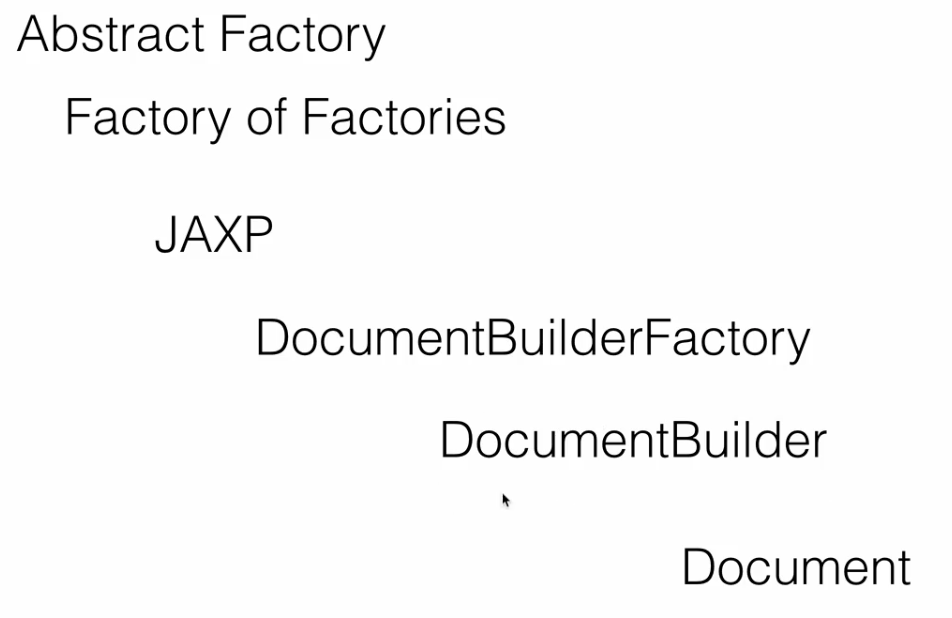
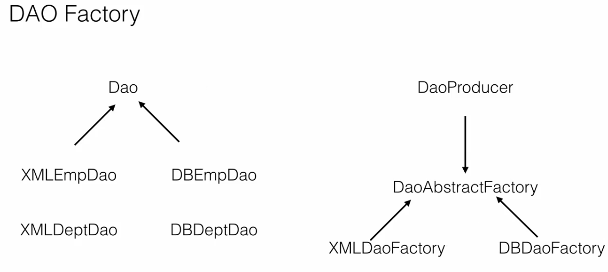
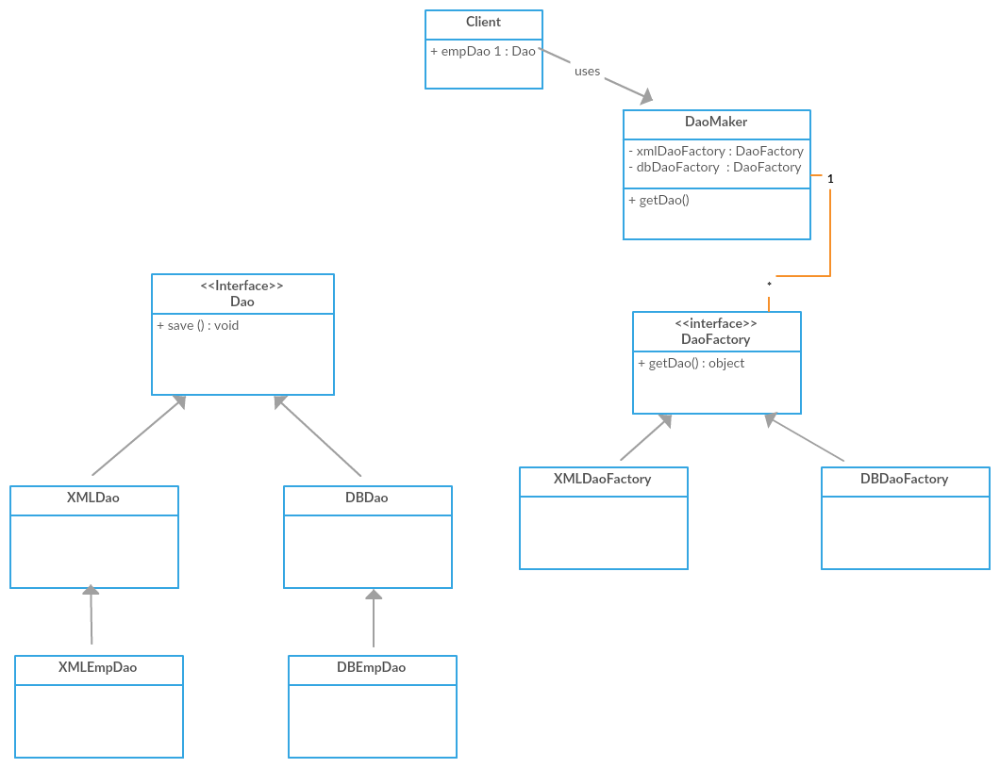

= Abstract Factory

Is a creational pattern and it hides creation of factories. Known as Factory of Factories.

Example 1 :

A good example in Java space is JAXP(Java APi for XML parsing) using this API we can read or write and update the elements in a xml file.
The key class in this API is the document class that represents a xml document in memory.

To create a Document class, We use that DocumentBuilder,So this DocumentBuilder is a factory class and there is one more class DocumentBuilderFactory which is responsible for creating the DocumentBuilder itself.
So the DocumentBuilderFactory is a abstract factory because it is a factory of factories.

Example 2 :
Another example is a DAO factory. DAO stands for data access object. It is a class which can perform read/write/update data.

There can be different types of DAO's. DAO's that deal with xml data and DAO's that deal with DB data and within xml we can have employee
information department information.Similarly within that database we can have employ information and department information.

So you can see that we can have a factory to deal with these separate DOA's we can have a DB DAO factory
that can give us one of these classes here when our application needs them and we can have a xml
DAO factory which can give one of the classes here.
Now to get one of these factories themselves these factories will first implement a DAO abstract factory
or they will extend DAO abstract factory class and we will have a producer which is responsible
for creating one of these factories so abstract factory is a factory off factories.
It simply creates the factory we need. when we have multiple factories. we see in our application.

--

Abstract Factory UML :

