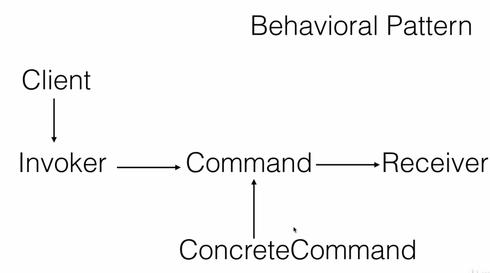
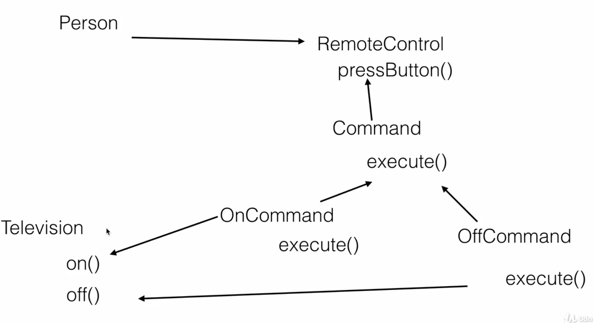
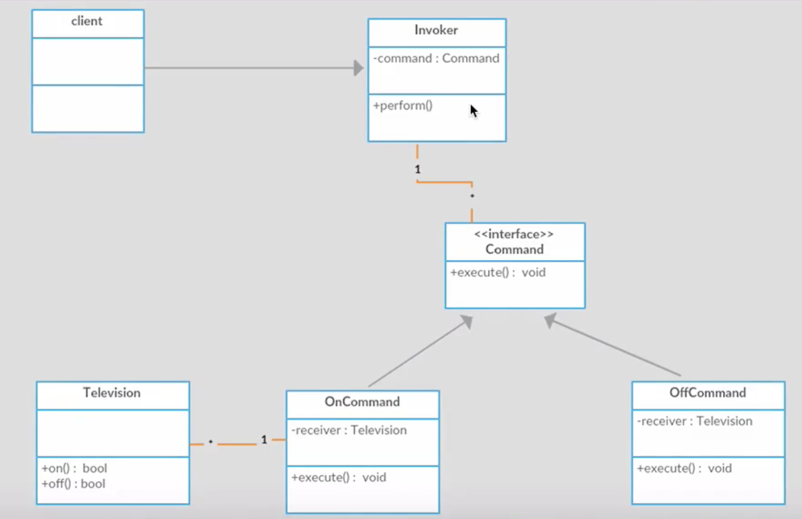

= Command Pattern

Is a behavioural pattern. It is used to encapsulate a request as an object and pass it to an invoker.
the invoker doesn't know how to service the client, it will take command and pass it to receiver which know how to perform.

There are five actors in command pattern as below :

- Example

- UML

