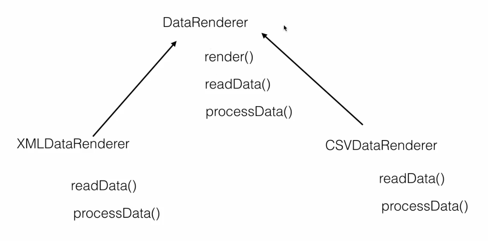

= Template Method

Is behavioural pattern and provides base template methods which can be used by child classes when we work on inheritance environment.

For Example :

DataRenderer class which can readData, ProcessData and Render/display the data to an end user but in our application, we want to render the data no matter in which format data is coming in whether its form of XML or CSV.
our goal is render the data using render() provided by parent class and let child class do the implementation of readData() and processData() as per their convenience.

Template Method Pattern UML

