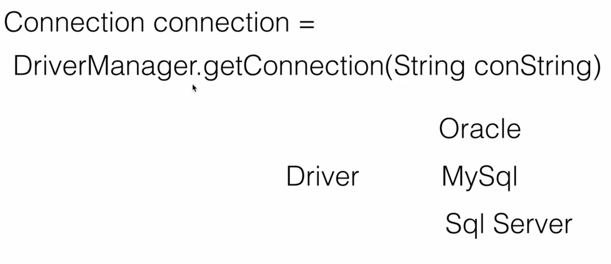
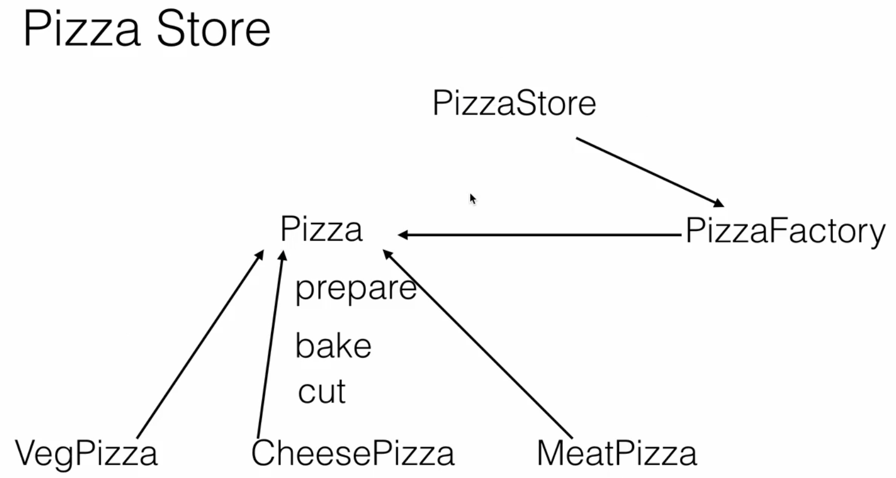

**Factory**

Is creational pattern that abstracts or hides the object creation process.

Think about the Car Factory, A car factory is responsible for manufacturing the cars.
A Car dealer need not worry about how the car is manufactured.Simply ask the car factory to deliver it to Dealer.
what essentially it does, it hides the complexity of object creation.

Example :
From JDBC space, when you connect to different database like Oracle, Mysql and Sql Server, we use jdbc driver which is an interface.
The implementation of Driver interface is provided by different vendors, responsibility of driver is to connect to a particular database and execute sql statements.
To get a connection, we need not remember each and every driver and how it works internally.

for example, you want to connect to oracle driver, mysql driver or sql server, you need not to deal with their drivers to connect appropriate database.
Instead you simply use DriverManager.getConnection(String conString) which is JDBC api and pass in a connection string which is a specific to a particular database.
The driver manager acts as a factory and it will return the connection for us by using the appropriate driver.
So it hides all the details of finding a driver and creating a connection against the database for us

Another Example :

PizzaStore -

A pizza store delivers different types of pizzas.Here we have a parent interface[Pizza] which is implemented by the veg pizza,cheese pizza and meat pizza.
The pizza store need not worry about how to create each of these pizzas. It simply asks the pizza factory to deliver the type of pizza it wants or to create a type of pizza it wants
so that it can give it to the customer or it can deliver it to the customer.
The pizza factory hides the complexity of creating the different types of pizzas from the pizza store.

