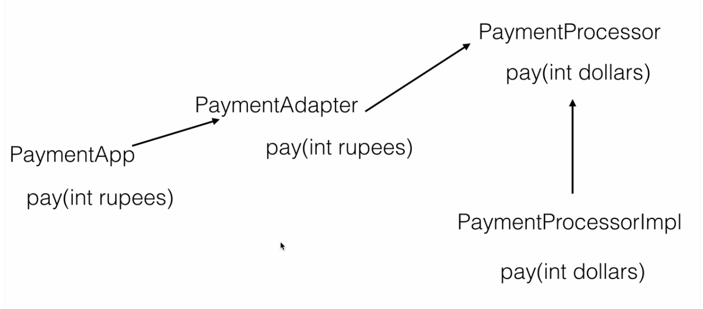

= Adapter

Is a structural pattern.

The adapter pattern is adapting between classes and objects. Like any adapter in the real world it is used to be an interface, a bridge between two objects. In real world we have adapters for power supplies, adapters for camera memory cards, and so on. Probably everyone have seen some adapters for memory cards. If you can not plug in the camera memory in your laptop you can use and adapter. You plug the camera memory in the adapter and the adapter in to laptop slot. That's it, it's really simple.

What about software development? It's the same. Can you imagine an situation when you have some class expecting some type of object and you have an object offering the same features, but exposing a different interface? Of course, you want to use both of them so you don't to implement again one of them, and you don't want to change existing classes, so why not create an adapter.

Example -

UML Adapter Pattern -

image::image/Adapter.png[]

Assignment

