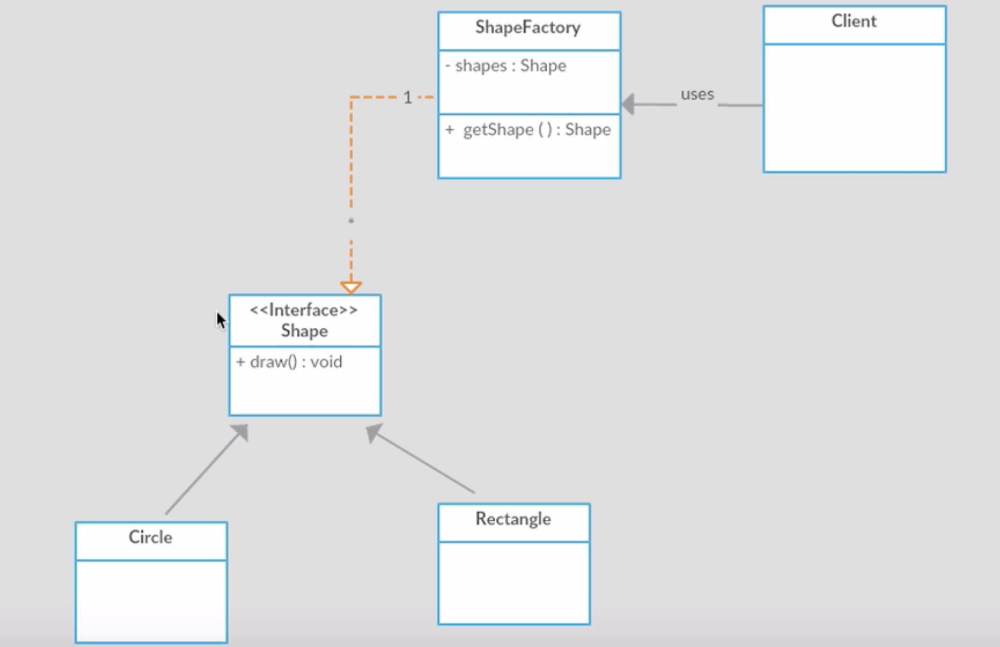

= Flyweight Pattern 

Three steps to solve the problem of creating the more than objects in memory.

- Separate the extrinsic state

[source,java]
.Circle.java
----

// they are specific to Circle
int radius,
String fillColor,
String lineColor
----

[source,java]
.Rectangle.java
----

// they are specific to Rectangle
int length,
int breadth,
String fillStyle

----

- Pass them as parameters

[source,java]
.Circle.java
----
    public void draw(int radius, String fillColor, String lineColor) {

        System.out.println("Drawing a " + label + " with radius : " + radius + " Fill Color : " + fillColor + " line Color : " + lineColor);
    }
----

[source,java]
.Rectangle.java
----

    public void draw(int length, int breadth, String fillStyle) {

        System.out.println(
                "drawing a " + label + " with length " + length + " Breadth " + breadth + " Fill Style " + fillStyle
        );
    }

----

- Create a factory class

[source,java]
.ShapeFactory.java
----

public class ShapeFactory {

    // caching the shapes
    private static Map<String, Shape> shapes = new HashMap<String, Shape>();

    public static Shape getShape(String type) {

        Shape shape = null;

        if (shapes.get(type) != null) {
            shape = shapes.get(type);
        } else {
            if (type.equals("circle")) {
                shape = new Circle();
            } else if (type.equals("rectangle")) {
                shape = new Rectangle();
            }
            shapes.put(type, shape);
        }
        return shape;
    }
}

----

- UML

